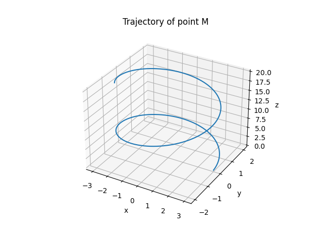

Point M moves according to the equation:

𝑟
⃗
(
𝑡
)
=
(
𝑎
cos
⁡
(
𝜔
𝑡
)
,
𝑏
sin
⁡
(
𝜔
𝑡
)
,
𝑏
𝑡
)
r
(t)=(acos(ωt),bsin(ωt),bt)

where $a, b, \omega$ are positive constants.

a) Find the equation of the point's trajectory,

From

𝑥
=
𝑎
cos
⁡
(
𝜔
𝑡
)
,
𝑦
=
𝑏
sin
⁡
(
𝜔
𝑡
)
,
𝑧
=
𝑏
𝑡
x=acos(ωt),y=bsin(ωt),z=bt

From the first two coordinates:

cos
⁡
(
𝜔
𝑡
)
=
𝑥
𝑎
,
sin
⁡
(
𝜔
𝑡
)
=
𝑦
𝑏
cos(ωt)=
a
x
	​

,sin(ωt)=
b
y
	​

Using

cos
⁡
2
(
𝜔
𝑡
)
+
sin
⁡
2
(
𝜔
𝑡
)
=
1
cos
2
(ωt)+sin
2
(ωt)=1

we get:

𝑥
2
𝑎
2
+
𝑦
2
𝑏
2
=
1
a
2
x
2
	​

+
b
2
y
2
	​

=1

Also from

𝑧
=
𝑏
𝑡
z=bt

we get

𝑡
=
𝑧
𝑏
t=
b
z
	​

So the full trajectory can be written parametrically as an elliptical helix:

𝑥
=
𝑎
cos
⁡
(
𝜔
𝑧
𝑏
)
,
𝑦
=
𝑏
sin
⁡
(
𝜔
𝑧
𝑏
)
,
𝑥
2
𝑎
2
+
𝑦
2
𝑏
2
=
1
x=acos(
b
ωz
	​

),y=bsin(
b
ωz
	​

),
a
2
x
2
	​

+
b
2
y
2
	​

=1

b) Compute the path length of the point from time $t=0$ to $t=t_0$,

Velocity:

𝑣
⃗
(
𝑡
)
=
𝑑
𝑟
⃗
𝑑
𝑡
=
(
−
𝑎
𝜔
sin
⁡
(
𝜔
𝑡
)
,
 
𝑏
𝜔
cos
⁡
(
𝜔
𝑡
)
,
 
𝑏
)
v
(t)=
dt
d
r
	​

=(−aωsin(ωt), bωcos(ωt), b)

Speed:

∣
𝑣
⃗
(
𝑡
)
∣
=
𝑎
2
𝜔
2
sin
⁡
2
(
𝜔
𝑡
)
+
𝑏
2
𝜔
2
cos
⁡
2
(
𝜔
𝑡
)
+
𝑏
2
∣
v
(t)∣=
a
2
ω
2
sin
2
(ωt)+b
2
ω
2
cos
2
(ωt)+b
2
	​

So the path length is:

𝐿
=
∫
0
𝑡
0
𝑎
2
𝜔
2
sin
⁡
2
(
𝜔
𝑡
)
+
𝑏
2
𝜔
2
cos
⁡
2
(
𝜔
𝑡
)
+
𝑏
2
 
𝑑
𝑡
L=∫
0
t
0
	​

	​

a
2
ω
2
sin
2
(ωt)+b
2
ω
2
cos
2
(ωt)+b
2
	​

dt

This is the general formula.

Special case when $a=b$:

∣
𝑣
⃗
(
𝑡
)
∣
=
𝑎
2
𝜔
2
(
sin
⁡
2
(
𝜔
𝑡
)
+
cos
⁡
2
(
𝜔
𝑡
)
)
+
𝑎
2
∣
v
(t)∣=
a
2
ω
2
(sin
2
(ωt)+cos
2
(ωt))+a
2
	​

∣
𝑣
⃗
(
𝑡
)
∣
=
𝑎
2
𝜔
2
+
𝑎
2
=
𝑎
𝜔
2
+
1
∣
v
(t)∣=
a
2
ω
2
+a
2
	​

=a
ω
2
+1
	​

Then:

𝐿
=
𝑎
𝜔
2
+
1
 
𝑡
0
L=a
ω
2
+1
	​

t
0
	​

c) Draw the trajectory of this point using Python or interactive HTML. Discuss special cases.

Python code:import numpy as np
import matplotlib.pyplot as plt

a = 3
b = 2
omega = 1
t0 = 10

t = np.linspace(0, t0, 1000)

x = a * np.cos(omega * t)
y = b * np.sin(omega * t)
z = b * t

fig = plt.figure()
ax = fig.add_subplot(111, projection='3d')

ax.plot(x, y, z)
ax.set_xlabel('x')
ax.set_ylabel('y')
ax.set_zlabel('z')
ax.set_title('Trajectory of point M')

plt.show()
Special cases:

If $a=b$, the projection on the $xy$-plane is a circle, so the curve becomes a circular helix.
If $a\ne b$, the projection on the $xy$-plane is an ellipse, so the curve is an elliptical helix.
If $\omega$ increases, the point winds around the axis faster.
If $b=0$ in the third coordinate, then $z=0$ and the motion becomes planar on the ellipse
𝑥
2
𝑎
2
+
𝑦
2
𝑏
2
=
1
a
2
x
2
	​

+
b
2
y
2
	​

=1
If $a=b$ and $\omega=1$, the motion is a standard circular helix with constant radius and uniform rise.